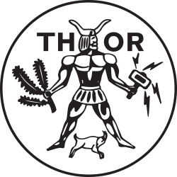
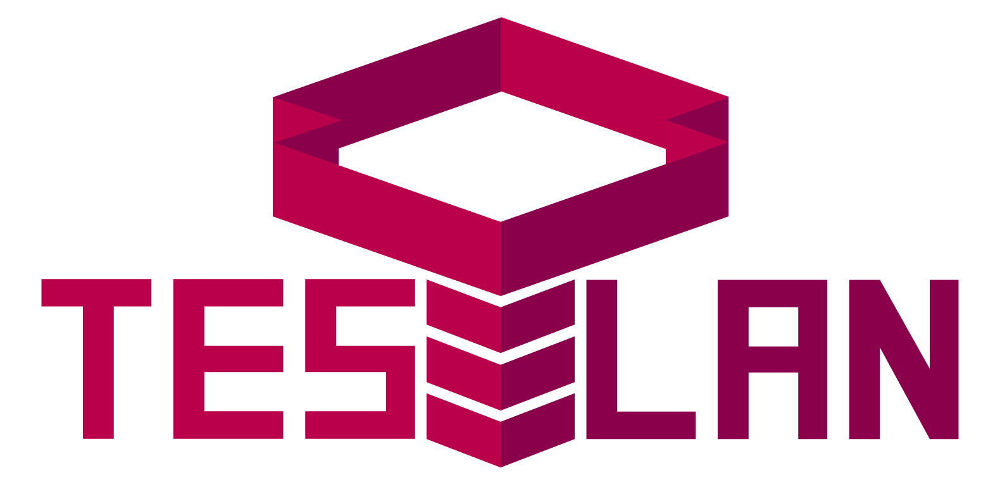
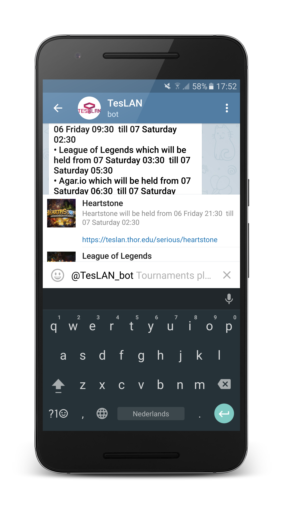
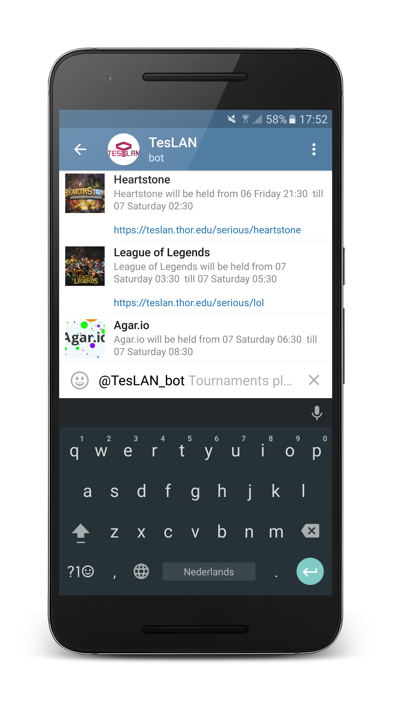
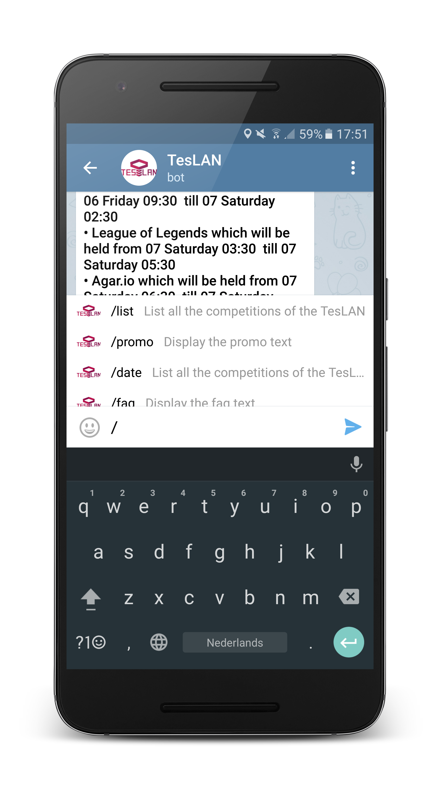
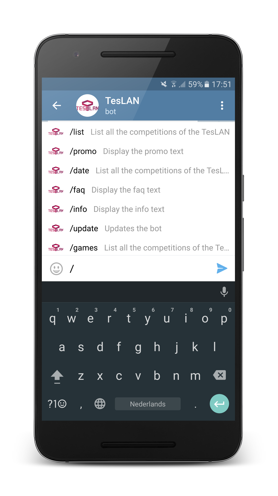

# LANCo Telegram Bot

This is the Github repository of the LANCo commission of e.t.s.v.
[Thor](https://thor.edu/)

This Telegram bot, is made for the [TesLAN](https://teslan.thor.edu/) which is a massive LAN party at the TU/e organized by the [LANCo](https://thor.edu/https://thor.edu/committee/lanco). If you are interested in joining the TesLAN please have a look at our site [TesLAN](https://teslan.thor.edu/)

Just open this  link to start chatting with the TesLAN bot
[Chat with the TesLAN bot](telegram.me/TesLAN_bot)

#### Todo List
- [x] Inline use
- [x] Normal in "chat" use
- [x] Poster function
- [x] Rss feed parser
- [ ] Facebook feed parser
- [ ] Faster poster function
- [ ] More integration





---

## How to use the TesLAN bot

### Inline mode

If you want to use the in-line mode of the bot just type @TesLAN_bot

 ```
@TesLAN_bot
 ```
 In any chat and you will be able to chose the available tournaments for more information





### Group chat mode

Currently the commands the TesLAN bot accepts and knows are the following :

```
  /list - List all the competitions of the TesLAN
  /promo - Display the promo text
  /date - List all the competitions of the TesLAN
  /faq - Display the faq text
  /info - Display the info text
  /update - Updates the bot
  /games - List all the competitions of the TesLAN
  /poster -Displays the TesLAN poster
```




### Changelog

- V0.1 First public release
- V0.11 Update of README.md
